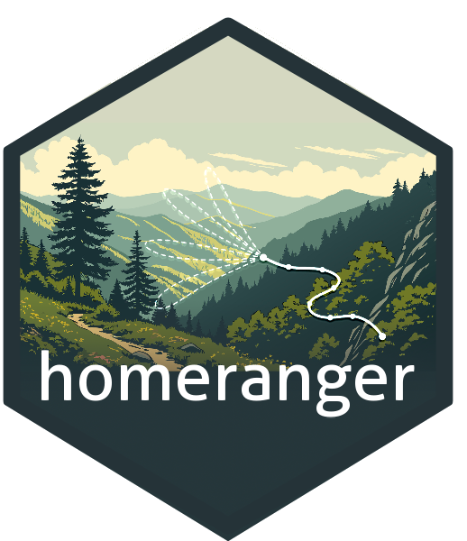

# homeranger 

This package allows for the estimation and simulation of home range behaviour, including both landscape patch dynamics (step selection) and memory effects. The mechanistic movement model allows you to: "(1) quantify the role of memory in the movements of a large mammal reintroduced into a novel environment, and (2) predict observed patterns of home range emergence in this experimental setting" Ranc et al. (2022).

## How to cite this package

> Ranc and Hufkens (2026). homeranger: a home range estimation framework.
> <https://doi.org/10.5281/zenodo.XYZ> (DOI PENDING); and the original model description:
> Ranc, N., Cagnacci, F., Moorcroft, P.R., 2022. Memory drives the formation of animal home ranges: Evidence from a reintroduction. Ecology Letters 25, 716–728. https://doi.org/10.1111/ele.13869.

## Installation

### stable release (PENDING)

To install the current stable release use a CRAN repository:

``` r
install.packages("homeranger")
library("homeranger")
```

### development release

To install the development releases of the package run the following
commands:

``` r
if(!require(remotes)){install.packages("remotes")}
remotes::install_github("bluegreen-labs/homeranger")
library("homeranger")
```

Vignettes are not rendered by default, if you want to include additional
documentation please use:

``` r
if(!require(remotes)){install.packages("remotes")}
remotes::install_github("bluegreen-labs/homeranger", build_vignettes = TRUE)
library("homeranger")
```
## Use

The current release is the first refactored version of the original C++ framework into R (with a C++ backend). The data handling is therefore not optimized. However, a reference example is given below, recreating the original results in Ranc et al. (2022).

```r
library(homeranger)
library(terra)

# read in the reference data, these are calculated with the
# shared original code and provide the step based likelihoods
# this output should match the output of the package for parity
reference <- read_csv("data-raw/validation/objective_function_detail.csv")
reference$likelihood[reference$likelihood == -9999] <- NA

# specify the parameters as used in the default run
# this is would be config_best_Mmem_fitting.txt
params <- list(
  r_l = 27.5332236990522,
  w_l = 0,
  r_d = 0.018257876686841,
  w_d = 0.9999,
  r_dist = 0.0412536435305482,
  w_dist = 0.9999,
  step_length_dist = 0.00216275705935606,
  step_length_shape = 1.14267311221975,
  threshold_approx_kernel = 7000,
  threshold_memory_kernel = 1000,

  # resource selection coefficients should be
  # a named list for driver data layer validation
  # and correct data processing
  coef = c(
    "slope" = 0.272835968106296,
    "slope_sq" = -0.093687792157105,
    "tcd_325grain"= 0.177991482087775,
    "tcd_325grain_sq" = -0.140639949444926,
    "landcover_5322" = 0.591063382485486,
    "landcover_agri" = -0.811974081226742
  )
)
```

```r
# sort and subset data
# load the raster data in a data cube, and reorder the layers
# based upon the order of the coefficients in the parameter
# list - finally convert to 3D array to be passed to the
# low level C++ functions
r <- terra::rast(list.files("data-raw/drivers/","*.asc", full.names = TRUE))
r <- as.array(subset(r, names(params$coef)))
r[is.na(r)] <- 0
```

```r
# run the model for these parameters
# in optimization mode (to check a traceable output)
# there should be ~parity as this is deterministic
output <- hr_predict(
  data = r,
  par = params,
  obs = "data-raw/tracks/Aspromonte_roedeer_traj.txt",
  resolution = 25,
  optimization = TRUE,
  verbose = TRUE
)

# plot the 1:1 graph - should be spot on
output$likelihood[output$likelihood == -9999] <- NA
plot(output$likelihood, reference$likelihood)
abline(0,1)
```

## Acknowledgements

The original model development was supported by the Harvard University Graduate Fellowship and a Fondazione Edmund Mach International Doctoral Programme Fellowship, with data and code made available at the Zenodo Digital Repository (https://doi.org/10.5281/zenodo.5189835 and https://doi.org/10.5281/zenodo.5208215, repository). The logo background was created by [Mohamed Smina and freely shared through Vecteezy.com](https://www.vecteezy.com/vector-art/66620012-scenic-mountain-trail-landscape-hiking-path-through-appalachian-mountains). Refactoring and further model development was supported by the French Office for Biodiversity on the TRANSLOC project (OF-25-0032).
