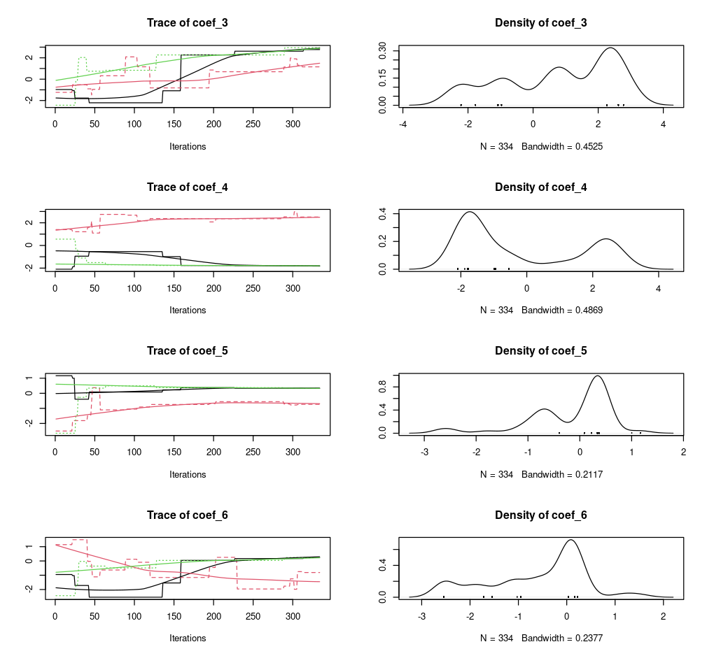

```{r setup, include = FALSE}
knitr::opts_chunk$set(
  collapse = TRUE,
  comment = "#>"
)

# the main package wrapper
library(homeranger)
library(BayesianTools)

# dependencies
library(terra)
library(dplyr)

# load compressed data
load(system.file("extdata/roedeer.rda", package = "homeranger"))
load(system.file("extdata/drivers.rda", package = "homeranger"))
obs <- obs[which(obs[,1] == 1196),]
```

Model calibration compares real world observations with model results, while varying the various parameters (tuning knobs) of the model. This is an iterative process in which an algorithm searches for the best solution in the large space of potential parameters defined by parameter ranges.

### Setting model parameter ranges

To calibrate our model we now have to specify additional settings. These are provided to the {homeranger} model as a nested list including the `metric` to use for evaluation, the `control` parameters for the {BayesianTools} optimization package (see the package reference for details), and the actual model parameters `par`. The model parameters include a sub-list of coefficients `coef` which should be of equal length to the number of layers used in your driver data. The model parameters `par` (and `coef`) are (named) lists of three values, a lower bound, an upper bound, and a starting value.

```{r echo = TRUE, message = FALSE, eval = TRUE}
par <- list(
  metric = "hr_cost",
  control = list(
    sampler = "DEzs",
    settings = list(
      iterations = 10000
    )
  ),
  par = list(
    r_l = list(lower=0.0001, upper=1, init = 0.5),
    w_l = list(lower=0.0001, upper=1, init = 0.5),
    r_d = list(lower=0.0001, upper=1, init = 0.5),
    w_d = list(lower=-1, upper=-0.0001, init = -0.5),
    r_dist = list(lower=0.0001, upper=1, init = 0.5),
    w_dist = list(lower=0.0001, upper=1, init = 0.5),
    step_length_dist = list(lower=0.0001, upper=0.1, init = 0.5),
    step_length_shape = list(lower=0.3, upper=3, init = 1),
    threshold_approx_kernel = list(lower=4000, upper=8000, init = 5000),
    threshold_memory_kernel = list(lower=500, upper=6000, init = 1000),

    # resource selection coefficients come last
    # these are unnamed
    coef = list(
      lower = rep(-3, 6),
      upper = rep(3, 6),
      init = rep(0, 6)
    )
  )
)
```

> In this demonstration the model optimization will only evaluate 1000 potential parameter sets to keep calculations short. Similarly, some of the parameter bounds are kept artificially narrow to speed up calcuations. You should not use these values as starting values in your own model fits!

### Calibration

Model calibration is done using the `hr_fit()` routine. This routine takes gridded drivers and actual observations as input. For the pre-processing of these I refer to the data formatting vignette!

```{r echo = TRUE, message = FALSE, eval = FALSE}
# calibrate the model and optimize free parameter
opt_par <- hr_fit(
  data = drivers,
  obs = obs,
  par = par,
  parallel = FALSE
  )
```

Model optimization results, in particular the parameter distributions, can be easily visualized using a plot command.

```{r echo = TRUE, message = FALSE, eval = FALSE}
# plot BayesianTools results
plot(opt_par$mod)
```

```{r echo = FALSE, message = FALSE, eval = TRUE, out.width="80%"}

```

> Note that all model calculations are done in memory. This means that if your driver data is large your model calibration (but also simulations) might fail. Remember that the model itself requires both space for to hold the driver data but also additional memory for the calculations, so assuming that being able to convert and prepare the data is does not imply that you have sufficient memory to run the model. Furthermore, memory requirements will multiply by the number of cores used during parallelization (see below). Where possible process will fail gracefully, but make note of memory requirements and consider this when designing a model calibration strategy.

### Parallelization

Different methods of parallelizations are possible, but they serve different needs. 

#### Parallel estimation of global parameters (internal)

First there is the parallel estimation of a single set of parameters which is shared across multiple observed individuals. Considerable speed can be gained by optimizing parameters in parallel. However, it depends on the data you provide. When using large (pooled data of many individuals) datasets for which a single set of parameters needs to be calculated you can use the built in `parallel` parameters (set to `TRUE`). This will provide you a speed up equivalent to the number of processing units available in your system. This method can also be used when you have a large amount of observations for a single individual. However, this use case is probably less common as you would multiple thousands of observations. In both cases the processing time of a total model run is large in comparison to the input/output overhead to the system due to the distribution and retrieval of data across the cluster processing units. For a single individual with a short track no speed gains will be made using the built in parallelization. When using this method is helpful to know that the number of iterations used are split across the number of parallel processes (chains).

#### Parallel estimation of individual parameters (external)

Alternatively, you can use a bespoke script to estimate model parameters for each individual separately. This method distributes `hr_fit()` calls across CPUs of your system/cluster. Below is one possible way to implement this using the {parallel} package.

First we'll create a nested list of coordinates, by individual. Note that you can use any other method to group individuals together.


```{r}
# split the list of coordinates
# according the the individual id
# or any other grouping factor (according to your experiment)
obs <- obs |>
  dplyr::group_split(id)

# show first elements of the list
head(obs, n = 2)
```

Next a cluster setup is defined with 4 cores, you can adjust this to your system settings. You can use `parallel::detectCores()` to detect the maximum number of cores on your system. It is adviced to use one core less than this maximum as the system management needs processing power, too. In addition, we use the `parallel::clusterExport()` function to send/forward all required functions to all cluster nodes. This includes for each node, the driver data `drivers`, the parameter ranges `par` and the fitting function `hr_fit()`.

```{r eval = FALSE}
# Create cluster with n cores
cl <- parallel::makeCluster(4)

# export functions / variables
parallel::clusterExport(
  cl,
  varlist = list("drivers","par", "hr_fit")
)
```

We now wrap the `hr_fit()` function in a wrapping function which only takes a single argument X on it's first position. We then call this wrapping function using the parallel `lapply()` function, `parallel::parLapply()`. This function a list of observations `obs` to distribute to the cluster `cl` and a function which takes an argument `X`, containing the subset of the list `obs` for which to estimate the parameters.

```{r eval = FALSE}
# custom wrapping function
split_fit <- function(X){
  hr_fit(
    data = drivers, # as forwarded to the cluster node
    obs = as.matrix(X), # provided to the cluster node as "X"
    par = par, # as forwarded to the cluster node
    parallel = FALSE
  )
}

# estimate optimal parameters for all entries in the
# list
opt_list <- parallel::parLapply(
  cl = cl,
  X = obs, 
  fun = split_fit
)

# stop the cluster, clean up the nodes
parallel::stopCluster(cl)
```

#### Parallel estimation of global parameters (external)

Observant readers will note that the above method could also be used to optimize global parameters if the data collected from the various processes (chains) could be combined. Luckily the {BayesianTools} package provides a utility function to do so, namely `BayesianTools::createMcmcSamplerList()`.

```{r eval = FALSE}
# split out model output details 
# from the standard hr_fit() output
mod <- lapply(opt_list, \(x) x$mod)

## Combine the chains
out <- BayesianTools::createMcmcSamplerList(mod)
```


